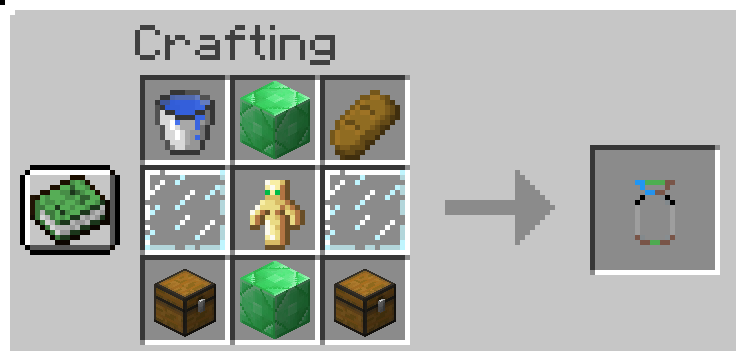

# Villager Capsule Mod for Minecraft 1.12.2

## Overview

The Villager Capsule Mod introduces a unique item – the "Villager Capsule" – allowing players to seamlessly capture and release villagers in the Minecraft 1.12.2 environment. This mod is crafted with the intention of elevating the player's ability to manage and relocate villagers within their world. Whether you're keen on establishing new settlements, optimizing existing villages, or simply fostering a more dynamic community, this plugin equips you with the necessary tools to sculpt your Minecraft realm.

## Features

- **Villager Capsule Item:** Craft the specialized capsule item to efficiently capture and release villagers at your discretion.

- **Versatile Villager Management:** Reshape your Minecraft world by relocating villagers with precision and ease.

- **Enhanced Settlement Creation:** Establish new villages or optimize existing ones, fostering a dynamic environment for your Minecraft community.

## Crafting Recipe

Crafting the Villager Capsule is a meticulous process that involves combining various items to create this powerful tool. The recipe is designed to provide a balanced and engaging gameplay experience.

### Ingredients:
- **Top Row:**
  - Water Bucket
  - Emerald Block
  - Bread

- **Middle Row:**
  - Glass Pane
  - Totem of Undying
  - Glass Pane

- **Bottom Row:**
  - Chest
  - Emerald Block
  - Chest

## Usage

1. **Crafting the Capsule:**
    - Gather the required materials and follow the crafting recipe to create an empty Villager Capsule.

2. **Capture Villagers:**
    - Use the empty capsule on a villager to capture them within the capsule.

3. **Release Villagers:**
    - Deploy the capsule again to release the villager at a new location.

## Installation
1. Download the mod jar file from the releases section.
2. Install Minecraft Forge if not already installed.
3. Place the mod jar file into the "mods" folder in your Minecraft directory.

## Compatibility
This mod is designed for Minecraft version 1.12.2 and requires Minecraft Forge for proper functionality.

## Contributions
Feel free to contribute to the development of this mod by submitting issues or pull requests on the GitHub repository.

## License
This mod is open-source and distributed under the [GNU Lesser General Public License v2.1 (LGPL-2.1)](LICENSE). Feel free to modify, distribute, and share it in accordance with the terms of the LGPL-2.1.

Dive into the Villager Capsule Mod and take control of your Minecraft villages like never before!